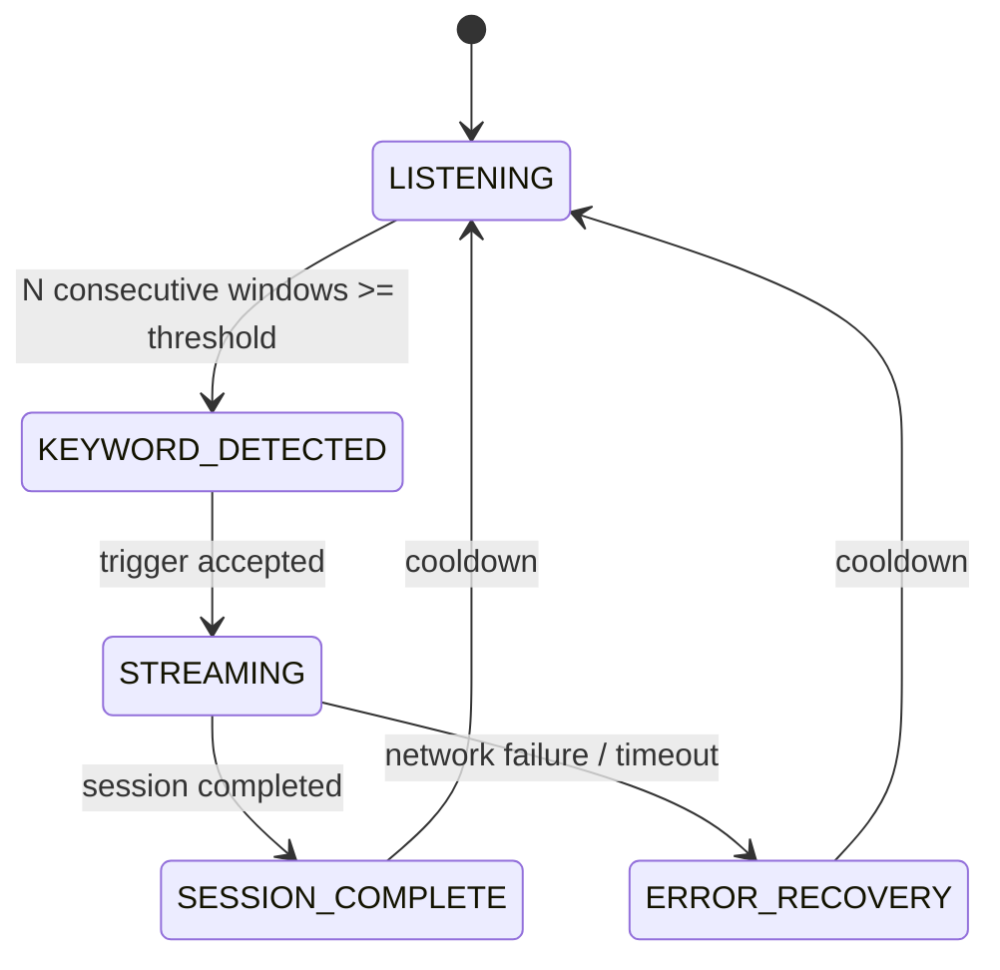

# Firmware State Machine



## States

### LISTENING

Audio capture runs continuously. The KWS task evaluates the latest audio window and feeds the result to `TriggerStateMachine`.

### KEYWORD_DETECTED

A keyword trigger has been accepted. The streaming path is notified so it can retrieve the configured pre-roll and establish the LAN session.

### STREAMING

The streaming task owns network I/O. It sends the session start, pre-roll, live audio, and session end, then handles the server response.

### SESSION_COMPLETE

The session completed successfully. The system returns to listening after the configured cooldown behavior.

### ERROR_RECOVERY

A connection, send, receive, or timeout failure occurred. The system exits the streaming path without remaining indefinitely blocked.

## Trigger logic

Current configuration:

- Threshold: `0.80`
- Consecutive positive windows: `3`
- Cooldown: `1500 ms`

The keyword probability must meet the threshold for the required number of consecutive inference windows before a trigger is accepted.

This reduces single-window false positives.

## Task separation

Audio capture must not perform network I/O directly.

The intended separation is:

```text
audio_capture_task
        |
        v
   ring buffer
        |
        v
     kws_task
        |
        v
 trigger request
        |
        v
 streaming_task
        |
        v
      LAN
```

## Current limitation

The present firmware reference pauses KWS evaluation while the system is outside `LISTENING`. Audio capture itself remains separate. If continuous trigger evaluation during streaming is required, that behavior should be redesigned and validated rather than assumed.
